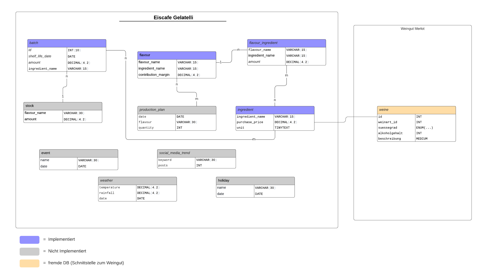

# Documentation

## Table of Contents

- [1. Introduction](#1-introduction)
  - [a. Purpose of the Documentation](#a-purpose-of-the-documentation)
  - [b. Target Audience](#b-target-audience)
- [2. Architecture Description](#2-architecture-description)
  - [a. High-Level Architecture](#a-high-level-architecture)
  - [b. Diagrams](#b-diagrams)
- [3. Program Structure](#3-program-structure)
  - [a. Module Structure](#a-module-structure)
  - [b. Important Classes and Methods](#b-important-classes-and-methods)
  - [c. Diagrams](#c-diagrams)
- [4. Program Execution and Workflow](#4-program-execution-and-workflow)
  - [a. Execution Process](#a-execution-process)
  - [b. Workflow Diagrams](#b-workflow-diagrams)
- [5. Interfaces and Communication](#5-interfaces-and-communication)
  - [a. Internal Interfaces](#a-internal-interfaces)
  - [b. External Interfaces](#b-external-interfaces)
- [6. Data Model](#6-data-model)
  - [a. Data Structures](#a-data-structures)
  - [b. Database Design](#b-database-design)
  - [c. Diagrams](#c-diagrams)
- [7. Logging](#7-logging)
  - [a. Logging](#a-logging)

## 1. Introduction
   ### a. Purpose of the Documentation
   The purpose of this technical documentation is to provide an overview of the technical aspects of the "Eiscafe Gelatelli" project. It aims to describe the          architecture, program structure, program execution and workflow, interfaces and communication, data model, and logging system.
   ### b. Target Audience: 
   The target audience for this documentation includes developers, system architects, and support staff who are involved in the development and maintenance of the "Eiscafe Gelatelli" project (In this case @Patrick Gutgesell & @Britta Jung).

## 2. Architecture Description
   ### a. High-Level Architecture
   The "Eiscafe Gelatelli" system has a client-server architecture. The client side is a JavaFX application that interacts with the server side, which is implemented   in Java and uses a MySQL database. The main components of the system include the controllers, models, resources, and utils packages, which are responsible for managing the business logic and user interface of the application.
   ### b. Diagrams
   A block ER Diagram illustrating the architecture of the "Eiscafe Gelatelli" system is provided below:
   Eiscafe Gelatelli System Architecture
   

## 3. Program Structure
   ### a. Module Structure
   The "Eiscafe Gelatelli" system is structured into several modules, including the controllers, models, resources, and utils packages. These packages contain classes that are responsible for implementing the business logic and user interface of the application.
   ### b. Important Classes and Methods
   Some of the important classes in the "Eiscafe Gelatelli" system include the ProductionInterface, ProductionService, WarehouseInterface, and WarehouseService classes, which provide interfaces and services for managing the production and warehouse functions of the system. The FlavourSingleton class is also important, as it provides a centralized storage for the flavour information.
   ### c. Diagrams
   A UML class diagram illustrating the program structure of the "Eiscafe Gelatelli" system is provided below:
   

## 4. Program Execution and Workflow
   ### a. Execution Process
  The execution process of the "Eiscafe Gelatelli" system involves starting the server side of the application, which initializes the database connection and starts listening for client requests. When the client side of the application is started, it connects to the server and interacts with it to manage the production and warehouse functions of the system.
   ### b. Workflow Diagrams
   A UML sequence diagram illustrating the workflow of the "Eiscafe Gelatelli" system is provided below:
   
   

## 5. Interfaces and Communication
   ### a. Internal Interfaces
   The main internal interface of the "Eiscafe Gelatelli" system is the communication between the client and server sides of the application. This communication is implemented using Java Remote Method Invocation (RMI) technology, which allows the client to invoke methods on the server and receive the results.
   ### b. External Interfaces: 
   The "Eiscafe Gelatelli" system interacts with external systems in two ways. First, it connects to a MySQL database to store and retrieve data. Second, it uses an external logging system, such as log4j2, to generate and store log messages.

## 6. Data Model
   ### a. Data Structures
  The main data structures used in the system include Batch, Flavour, Ingredient, and FlavourIngredient. The Batch class represents a batch of ice cream produced in the production process, which is associated with a specific flavour and a production date. The Flavour class represents an ice cream flavour and has a unique name, description, and a list of ingredients. The Ingredient class represents an ingredient used in the production of ice cream and has a name, description, and unit of measurement. The FlavourIngredient class represents the quantity of an ingredient required to produce a specific flavour of ice cream.
   ### b. Database Design
   The system uses a MySQL database to store and retrieve data. The database design includes five tables: Batch, Flavour, Ingredient, FlavourIngredient, and ProductionLog. The Batch table has columns for batch ID, flavour ID, production date, and quantity produced. The Flavour table has columns for flavour ID, name, and description. The Ingredient table has columns for ingredient ID, name, description, and unit of measurement. The FlavourIngredient table has columns for flavour ID, ingredient ID, and quantity required. The ProductionLog table has columns for production log ID, batch ID, and production date.
   ### c. Diagrams
   Here is an Entity-Relationship diagram (ERD) that illustrates the data model for the system:
    

## 7. Logging
   ### a. Logging
   The system uses the Log4j2 logging framework to log events and errors. Log messages are generated using various logging levels, including DEBUG, INFO, WARN, and ERROR. The log messages are stored in a file called 'eiscafegelatelli.log' in the project's root directory.
The logging configuration is defined in the 'log4j2.xml' file, which specifies the log file path, logging pattern, and log levels. The logging system is designed to provide detailed information about the system's behavior, including request handling, data processing, and error handling.
